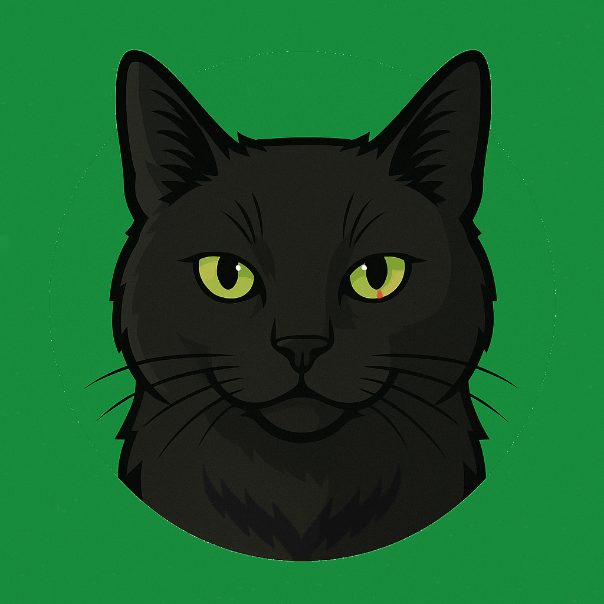

Welcome to <b>Pepeto (PETO)</b> – the community-driven memecoin on Solana. 

Our mission is simple: <b>combine meme culture with sustainable tokenomics</b>.
  

#### CA: ``

---

## 🌍 Vision
Pepeto is not just a meme – it’s a project with **transparent tokenomics, locked liquidity, and structured vesting**.  

---

## 🪙 Token Overview
- **Name:** Pepeto  
- **Ticker:** PETO  
- **Blockchain:** Solana  
- **Total Supply:** 100,000,000,000 (100B)  
- **Decimals:** 6  

---

## 📊 Tokenomics
👉 [Check our tokenomics](tokenomics.md)

| Allocation              | %    | Tokens              |
|--------------------------|------|---------------------|
| Dev Wallet / Liquidity   | 10%  | 10,000,000,000 PETO |
| Initial Burn             | 15%  | 15,000,000,000 PETO |
| Second Dev / Trade       | 1%   | 1,000,000,000 PETO  |
| Airdrops                 | 1.5% | 1,500,000,000 PETO  |
| Pre-Sale                 | 5%   | 5,000,000,000 PETO  |
| Treasury / Vesting       | 3%   | 3,000,000,000 PETO  |
| **Circulating Supply**   | 64.5%| 64,500,000,000 PETO |

---

## 🔒 Security
- Liquidity **locked for 5 years**  
- Treasury with **10-year vesting (monthly unlocks)**  

---

## 🗺 Roadmap
👉 [Check our roadmap](roadmap.md)

---

## 📄 Whitepaper
👉 [Read the full whitepaper](whitepaper.md)

---

## 💰 Pre-Sale
- **Total Allocation:** 5% (5,000,000,000 PETO)
- 👉 [Check our pre-sale](presale.md)

---

## 📢 Community
- 🐦 [Twitter](https://x.com/PepetoAltCoin)  
- 📸 [Instagram](https://www.instagram.com/pepetoaltcoin/)  
- 💻 [GitHub](https://github.com/pepetoaltcoin/pepetoaltcoin.github.io?tab=readme-ov-file#-pepeto-peto)
- ❓ [FAQ](faq.md)  

<b>Join the Black Cat Revolution!</b> 🐾  

